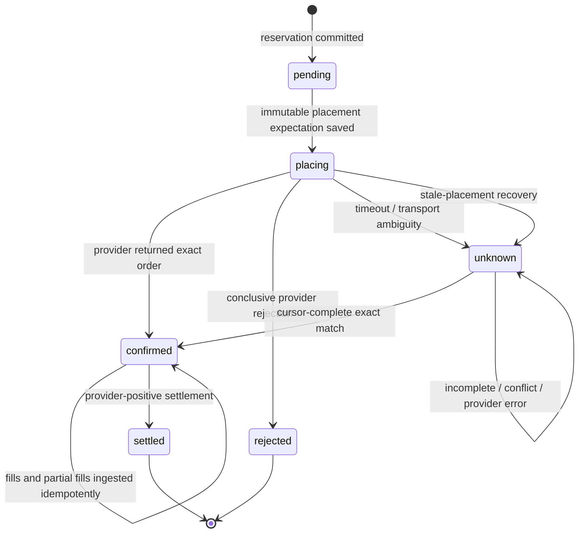
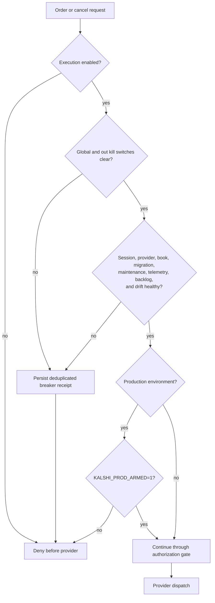

# Authorized Partner Execution

Status: implemented, default off. This is the operational work card for the
authorization, Telegram approval, exposure reservation, Kalshi mapping, and live
HTTP orchestration layers.

## Authority boundary

Live provider placement follows one path:

```text
HTTP compliance
  → authenticated operator principal + partner/out scope
  → proposed regulatory play bound to execution idempotency
  → canonical partnerCode / outId / skin request
  → active SQLite authorization + immutable policy hash
  → fresh executable Kalshi book + live portfolio balance
  → integer stake caps + transactional exposure reservation
  → idempotent Kalshi V2 placement
  → confirmed, rejected, or unknown reservation + durable receipt
  → cursor-complete order/fill lifecycle + append-only journal
```

Skills, agent instructions, documentation, hooks, CI, and dashboard controls do
not grant trading permission. They can only inspect, test, or document this
path. Runtime permission comes from verified database state and the explicit
environment gates below.

## Runtime gates

| Gate                                           | Expected behavior                                                                   |
| ---------------------------------------------- | ----------------------------------------------------------------------------------- |
| `KALSHI_AUTHORIZED_EXECUTION_ENABLED=1`        | Opens the partner HTTP execution breaker; unset is dry-run/fail-closed              |
| `KALSHI_ENV=demo`                              | Default provider host; does not require production arming                           |
| `KALSHI_ENV=prod`                              | Selects the production provider host                                                |
| `KALSHI_PROD_ARMED=1`                          | Required in addition to `KALSHI_ENV=prod`                                           |
| active authorization grant                     | Must match partner, out, skin, provider, currency, scope, validity, and policy hash |
| risk health                                    | Must remain healthy before and during snapshot evaluation                           |
| `KALSHI_EXECUTION_KILL_SWITCH=1`               | Global emergency stop                                                               |
| `KALSHI_<PARTNER>_<N>_EXECUTION_KILL_SWITCH=1` | Per-out emergency stop                                                              |

Each out must also publish explicit, fresh health evidence under its canonical
prefix: `PROVIDER_SESSION_HEALTHY`, `PROVIDER_HEALTHY`,
`BALANCE_EXPOSURE_DRIFT_CENTS`, `MAINTENANCE_AT_MS`, and `TELEMETRY_AT_MS`.
Missing, stale, malformed, or misspelled evidence denies execution.

`KALSHI_ALPHA_LIVE` belongs to alpha programs and does not enable this route.

## Request contract

Live `POST /api/trading/order` requests require:

- `partnerCode`, canonical `outId`, active `skin`, `ticker`, and `outcome`
- integer `stakeMinorUnits` and `priceCents`
- an explicit, stable `Idempotency-Key`
- compliance fields and middleware context: state, node, sport, market, wager,
  and bet type
- `Authorization: Bearer …` whose SHA-256 digest, actor, role, and scopes are
  configured through `KALSHI_OPERATOR_*`; the raw token is never configured

Dry-run order previews remain explicitly public. Every cancellation is a live
mutation and requires the operator principal. `POST /api/trading/cancel`
resolves the provider ticket through the local reservation before checking
scope, the original live authorization, risk health, out credentials, and
production arming. Ambiguous cancellation retains exposure.

The route rejects post-only requests because the authorization snapshot binds
the order to immediately executable top-of-book liquidity.

## Credentials and provider state

Kalshi credentials resolve in this order:

1. out: `KALSHI_SPORTS_1_*`
2. partner: `KALSHI_SPORTS_*`
3. global fallback: `KALSHI_*`

The client cache fingerprints credential inputs and rebuilds automatically after
key rotation. Kalshi uses signed RSA requests rather than a refresh-token flow;
the live `/portfolio/balance` call proves the current credentials and supplies
available balance to the gate.

## Expected fail-closed outcomes

- Missing/mismatched partner, out, skin, provider, currency, or grant: denied.
- Stale/missing/crossed book, quote mismatch, unavailable balance, or unhealthy
  risk state: denied before reservation or provider placement.
- Known provider rejection: reservation failed and exposure released.
- Ambiguous provider outcome: reservation remains unknown and exposure remains
  held until the reconciler finds an exact deterministic client-order match.
- Missing, malformed, conflicting, or failed reconciliation evidence never
  releases exposure and never converts the reservation to a rejection.
- Fantasy402: HTTP 501 with no provider call.

Credit lines and dedicated partner wallets are not modeled in the current
registry, so the gate does not invent either. Available capacity is the live
Kalshi balance constrained by authorization, skin, daily, exposure, max-win, and
executable-liquidity limits.

## Lifecycle and recovery



An unknown or placing reservation remains exposure-bearing. Absence from a
bounded or incomplete provider page is never rejection evidence. Cancellation
acknowledgement also leaves the reservation confirmed until lifecycle ingestion
proves the unfilled working quantity; filled position exposure remains until a
provider-positive settlement.



Recovery never toggles an arm flag. Restore provider and telemetry evidence, run
the one-shot reconciliation, lifecycle, and receipt workers, inspect their
nonzero exits and durable backlog, then clear only the kill switch that an
operator deliberately set. A healthy evaluation on the next request is the only
way back through the breaker.

## Operator proof

```bash
bun test tests/partner/authorization tests/partner/execution tests/research/trading-order.test.ts
bun run bun:ci
bun run partner:reconcile-kalshi -- --limit=100
bun run partner:sync-kalshi-lifecycle -- --max-pages=10 --page-size=1000
bun run partner:deliver-receipts -- --limit=100
bun run partner:execution:preview -- --count=3
bun run partner:execution:register
```

## Operator runbook

### Start or verify demo operations

1. Keep `KALSHI_ENV=demo` and `KALSHI_PROD_ARMED` unset. Configure the hashed
   operator principal, active authorization, out-scoped credentials, and fresh
   health evidence without printing secret values.
2. Preview all three independently named workers, then register them:

   ```bash
   bun run partner:execution:preview -- --count=3
   bun run partner:execution:register
   ```

3. Exercise each worker once and require a zero exit:

   ```bash
   bun run partner:reconcile-kalshi -- --limit=100
   bun run partner:sync-kalshi-lifecycle -- --max-pages=10 --page-size=1000
   bun run partner:deliver-receipts -- --limit=100
   ```

4. Collect the day from the registered Kalshi demo out. Capture the balance
   checkpoint no later than the start of the proof day, then collect after the
   day is complete:

   ```bash
   bun run partner:execution:demo-collect -- --partner=SPORTS --out=out-SPORTS-1 --day=2026-08-07 --record-checkpoint
   bun run partner:execution:demo-collect -- --partner=SPORTS --out=out-SPORTS-1 --day=2026-08-07
   ```

   The out-wide collector includes every skin sharing the provider account. It
   refuses production state, loads cursor-complete provider and SQLite evidence,
   executes focused production-service recovery tests with mocked external I/O,
   redacts the artifact, and exits nonzero when the day fails.

### Breaker or reconciliation incident

1. Set the global or canonical per-out `EXECUTION_KILL_SWITCH=1` when manual
   containment is required. Do not change authorization rows or delete
   reservations to make health appear clean.
2. Run the three one-shot workers above. Treat incomplete pagination, conflict,
   malformed evidence, and provider errors as unresolved; exposure stays held.
3. Inspect structured maintenance counts: oldest placing/unknown and receipt
   age, due/leased backlog, reconciliation attempts/errors/conflicts, fill lag,
   and provider-accounting drift. Resolve the underlying provider, telemetry,
   credential, or database condition.
4. Rerun the one-shot workers until they exit zero and the durable backlog is
   explained. Clear only the manually set kill switch. Never set a production
   arm variable as part of recovery.

### Schedule removal

```bash
bun run partner:execution:remove
```

Removing schedules stops future worker fires; it does not release exposure or
change any reservation, authorization, breaker, or production-arm state.

`Bun.TOML.stringify` is optional on the stable runtime: the governed
`src/partner/toml-stringify.ts` boundary uses the native API when present and a
tested compatibility serializer otherwise.

The reconciler searches bounded, cursor-complete active and historical Kalshi
feeds and verifies environment, ticker, client ID, outcome, book side, count,
and price against terms persisted before dispatch. Reconciliation, account-wide
lifecycle ingestion, and durable receipt delivery are separate one-shot workers;
the OS schedule keeps them independently named so Telegram polling is never
execution infrastructure. Lifecycle ingestion derives the exact
partner/out/skin/currency lane from each immutable reservation, allowing
multiple skins on one account without attributing unlinked/manual orders.

Cursor-complete order/fill ingestion tracks working, filled, cancelled, and
settled quantities. The append-only integer journal records reservation, order,
fill, fee, cancellation, settlement, adjustment, and reversal entries. Account
orders that cannot be linked to a local authorized reservation remain visible in
provider lifecycle storage but are never attributed to a partner journal. Linked
orders must match the exact partner/out/skin/currency lane. Cancellation
acknowledgement alone does not release exposure: only normalized provider
lifecycle evidence releases unfilled working quantity, while filled position
exposure remains until provider-positive settlement.

The lifecycle worker explicitly binds Kalshi V2 placement, order, fill,
settlement, position, balance, and cancellation calls to primary subaccount
`0`; omitted-subaccount reads are forbidden because Kalshi otherwise returns
orders/fills/settlements across all subaccounts. Signed settlement pages are
the only automatic settlement evidence. Each run persists durable per-out
status plus cursor-complete orphan/fill-lag metrics. The first signed balance
observation establishes an owned cash baseline; later observations compare the
provider balance to baseline plus journal cash deltas, and compare paginated
provider positions to linked filled-unsettled lifecycle quantities. Any drift
opens the execution risk breaker and makes the scheduled worker fail nonzero.

## Demo graduation

The dependency-ordered backlog, sub-agent ownership, and acceptance criteria
live in
[`AUTHORIZED_EXECUTION_REMAINING_WORK.md`](AUTHORIZED_EXECUTION_REMAINING_WORK.md).

- Generate the authoritative redacted daily artifact with
  `bun run partner:execution:demo-collect` as described in the runbook. The
  lower-level `partner:execution:demo-proof -- --input=<sanitized.json>` command
  remains available for offline compiler validation, but caller-supplied input
  is not graduation evidence.
- After seven real days, run
  `bun run partner:execution:demo-graduation -- --input=<day-1.json> ... --input=<day-7.json>`
  to recheck daily criteria, UTC continuity, and the tamper-evident artifact
  chain.
- Seven consecutive real demo days are still required. Tests and generated
  fixtures cannot simulate elapsed soak time or authorize production.
- Keep Fantasy402 unwired until provider-side idempotency is proven.
- Add credit-line or dedicated-wallet accounting only when an owned domain
  contract and ledger source exist.
