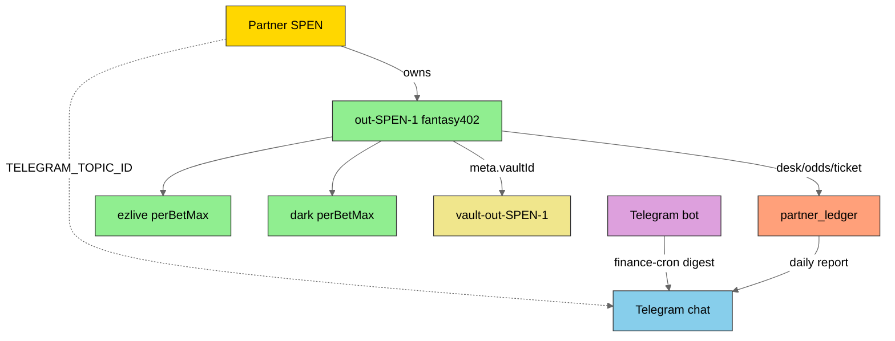

# Partner domain architecture

Five interconnected layers. **Seat-capital-shaped** naming; **Kalshi-bot** is
the local SSOT for registry + Fantasy Ultra until a separate seat-capital
service is the only writer.

Machine status: `bun run partner:domain` · `bun run partner:domain -- --json`  
Code map: [`src/partner/domain.ts`](../src/partner/domain.ts)

---

## Layers

| Layer               | Purpose                  | Kalshi-bot home                                                            |
| ------------------- | ------------------------ | -------------------------------------------------------------------------- |
| **Partner**         | Financial owner          | `partners` table · profit_split / commission_rate                          |
| **Communication**   | Chat / bot / alerts      | `src/telegram/` · finance-cron notify · `TELEGRAM_TOPIC_ID_{CODE}`         |
| **Accounts / Outs** | Betting accounts + skins | `betting_accounts` · `meta.skins[]` · `partner:capacity`                   |
| **Assets**          | Credentials & identity   | Proton Pass · per-out `env_prefix` · `meta.vaultId` (no secrets in DB)     |
| **Finance**         | Ledger & reports         | Legacy `partner_ledger` plus the separate authorized-execution journal     |

### Maturity legend

| Mark        | Meaning                                  |
| ----------- | ---------------------------------------- |
| **built**   | Shipped and usable in this repo          |
| **partial** | Scaffold / one path works; not full loop |
| **planned** | Named in architecture; not implemented   |

Run `bun run partner:domain` for the live component checklist.

---

## Relationship diagram



---

## Naming

| Entity        | Rule                             | Example                          |
| ------------- | -------------------------------- | -------------------------------- |
| Partner code  | Uppercase short                  | `SPEN`                           |
| Out ID        | `out-{code}-{n}`                 | `out-SPEN-1`                     |
| Vault         | `vault-{outId}`                  | `vault-out-SPEN-1`               |
| Liquidity key | `{outId}@{skin}`                 | `out-SPEN-1@ezlive`              |
| Avatar        | `{code}.svg/png`                 | `SPEN.png`                       |
| Env prefix    | **Per-out** `{BOOK}_{CODE}_{N}_` | `FANTASY402_SPEN_1_`             |
| Env secrets   | `{prefix}{KEY}`                  | `FANTASY402_SPEN_1_BEARER_TOKEN` |

---

## What is built today

### Partner + Accounts

- `partners` / `betting_accounts` in event-store
- Out × skin matrix (`skins.ts`, `partner:capacity`)
- Fantasy402 adapter: login, stream-list, sports inventory (30 buckets), Pandora
  coefficients
- Seed: `FANTASY402_PARTNER_CODE`, `FANTASY402_SKINS_JSON`,
  `FANTASY402_VAULT_ID`

### Assets

- Secrets via env / Proton Pass only (`partner:vault:provision`)
- DB holds `env_prefix` + non-secret `meta_json` only
- **Visuals** (`src/partner/visuals.ts`): deterministic HSL → `Bun.color`
  hex/rgba/ansi-16m, contrast text, SVG + PNG avatars (`partner:profile` /
  `partner:avatars`)

### Communication (partial)

- Telegram bot for calibration/dashboard subscribe
- `partner:finance-cron --notify` with optional `TELEGRAM_TOPIC_ID_{CODE}`
- Hash-bound authorization approval/revocation and a durable receipt outbox
- Reconciliation, lifecycle, and receipt delivery run independently of Telegram
  long polling

### Finance (partial → live kinds)

- `partner_ledger`: `desk_snapshot` (cron) · `odds_book` (ws-ingest) · `ticket`
  (ingest-tickets / betGroups)
- Ticket ingest upserts on ticketNumber; stores legs + open/settled status from
  wire markers
- Finance-cron / health report open risk vs settled count when tickets exist
- Settlement list URL still unmapped — net P&L after settle is planned
- Kalshi authorized execution has a separate append-only integer journal for
  reservation, fill, fee, cancellation, settlement, reversal, cash, exposure,
  realized P&L, and partner-split projections

### Authorized Kalshi execution (built, default off)

- Authenticated order and cancellation routes resolve the exact
  partner/out/skin/account and require an active hash-bound SQLite grant.
- Fresh executable book, live balance, liquidity, daily/exposure caps,
  fail-closed risk health, and transactional reservation all precede provider
  dispatch.
- Cursor-complete account order/fill lifecycle ingestion and the immutable
  execution journal preserve partial-fill and settlement accounting.
- Independent reconciliation, lifecycle, and receipt workers plus the demo
  evidence collector are operational tooling; production still requires a
  separately reviewed arm decision after seven real passing demo days.
- Fantasy402 execution remains HAR-only and is not connected to this path.

---

## Target interaction flows

| Action               | Target flow                                                                        | Today                                                                         |
| -------------------- | ---------------------------------------------------------------------------------- | ----------------------------------------------------------------------------- |
| Onboard partner      | Partner row + Telegram group + avatar                                              | Partner row + seed out; TG/avatar manual                                      |
| `/add` out           | Bot → vault + out + confirm                                                        | CLI seed / vault provision                                                    |
| `/capacity`          | Bot → capacity tree                                                                | `bun run partner:capacity`                                                    |
| Daily report         | Cron → desk + tickets → TG                                                         | **Built** (`partner:finance-cron`); settlement P&L planned                    |
| Kalshi execution     | Authenticated route → grant/risk gate → reserve → place/cancel → lifecycle journal | **Built, default off**; demo evidence soak remains open                       |
| Fantasy402 execution | Route out@skin → place → legacy ticket ledger                                      | HAR map only; ticket ingest from betGroups; not wired to authorized execution |

---

## Operator catalog (Bun-only)

**Global tool required:** Bun. Everything else is `bun run` / `bunx` (e.g.
`bunx drizzle-kit`).
No Vite/React partner UI — static board baked from SQLite.

### Daily loop

```bash
# 1. Config
bun run partner:toml -- --diff
bun run partner:toml -- --check-env
bun run partner:toml -- --seed

# 2. Ops visibility
bun run partner:capacity
bun run partner:health
bun run partner:dashboard -- --open

# 3. Secrets readiness (no secret echo) + optional signed login
bun run partner:desk-smoke -- --seed
bun run partner:desk-smoke -- --out=out-SPEN-1
# after Pass inject:
# bun run protonpass:run -- bun run partner:desk-smoke -- --login --out=out-SPEN-1
# bun run protonpass:run -- bun run partner:test-fantasy -- --out=out-SPEN-1

# 4. Live book (WebView) — needs LIVE_DESKTOP_URL from login() or public plive
bun run partner:ws-ingest -- --capture --seconds=25 --out-id=out-SPEN-1 --partner-code=SPEN

# 5. Desk report + optional Telegram
bun run partner:finance-cron -- --notify --risk-threshold=error

# 6. Serve static board (routes wired in src/research/serve.ts)
bun run serve
# → http://localhost:<port>/partner-dashboard/
# → http://localhost:<port>/partner-dashboard/state.json
```

### Full CLI map

| Command                                               | Layer                                                                 |
| ----------------------------------------------------- | --------------------------------------------------------------------- |
| `partner:domain`                                      | All (status)                                                          |
| `partner:toml`                                        | Partner + Accounts (Bun.TOML config seed/export)                      |
| `partner:health`                                      | Registry + env + risk + ledger freshness                              |
| `partner:desk-smoke`                                  | Per-out secret readiness + optional signed `login()`                  |
| `partner:dashboard`                                   | Static HTML board + `state.json` (no Vite)                            |
| `partner:finance-cron`                                | Desk report + risk Telegram + optional auto-ws                        |
| `partner:reconcile-kalshi`                            | Leased ambiguous-placement reconciliation                             |
| `partner:sync-kalshi-lifecycle`                       | Cursor-complete account order/fill/settlement ingestion               |
| `partner:deliver-receipts`                            | Leased durable Telegram receipt delivery                              |
| `partner:execution:preview` / `:register` / `:remove` | Independent Bun cron worker lifecycle                                 |
| `partner:execution:demo-collect`                      | Authoritative demo provider/SQLite evidence + deterministic scenarios |
| `partner:execution:demo-graduation`                   | Seven-day continuity and artifact-chain verifier                      |
| `partner:execution:demo-proof`                        | Offline sanitized-input compiler validation only                      |
| `partner:test-fantasy`                                | Live Ultra session smoke (`--out=` prefix-aware)                      |
| `partner:vault:provision`                             | Assets — Proton custom item + `pass://` map (`--out=`)                |
| `partner:webview-ws-capture`                          | Bun.WebView CDP → Pandora JSONL frames                                |
| `partner:ws-ingest`                                   | JSONL/capture → coefficients → `odds_book` ledger                     |
| `partner:ingest-tickets`                              | betGroups JSON/JSONL → `ticket` ledger                                |
| `partner:placebet-har`                                | Chrome HAR → PlaceBet URL map (+ optional ticket ingest)              |
| `partner:capacity` / `partner:registry`               | Accounts                                                              |
| `partner:profile` / `partner:avatars`                 | Partner visuals (Bun.color)                                           |
| `partner:sports`                                      | Accounts (inventory)                                                  |
| `partner:sync`                                        | Accounts (events)                                                     |
| `partner:pandora-probe`                               | Pandora Socket.IO probe                                               |
| `bun src/telegram/bot.ts`                             | Communication                                                         |
| `bunx drizzle-kit …`                                  | DB tooling only (not a global install)                                |

### Dependency rule

| Level             | Contents                                 |
| ----------------- | ---------------------------------------- |
| Global            | **Bun** only                             |
| package.json deps | Domain runtime (`drizzle-orm`, `zod`, …) |
| devDependencies   | Reproducible CI (`typescript`, types)    |
| `bunx`            | One-off CLIs (`drizzle-kit`, generators) |

### Partners TOML (`Bun.TOML`)

Non-secret registry on disk (v1.1 TOML via Bun native parse/stringify + **Zod**
shape check):

```bash
cp config/partners.example.toml config/partners.toml   # edit outs/skins
bun run partner:toml -- --validate
bun run partner:toml -- --diff              # TOML vs DB (no write)
bun run partner:toml -- --dry-run           # same as diff, explicit no-write
bun run partner:toml -- --check-env         # secret presence (no values printed)
bun run partner:toml -- --seed              # upsert (+ shows diff + env warn)
bun run partner:toml -- --seed --strict-env # fail if secrets missing
bun run partner:toml -- --export --out=config/partners.export.toml
bun run partner:capacity
# CI / pre-commit (auto when partner TOML paths staged — see tools/pre-commit.sh):
bun run partner:toml:validate
bun run partner:health
bun run partner:health -- --strict-env    # exit 2 if secrets missing
bun run partner:health -- --strict-risk   # exit 2 if findings ≥ threshold
bun run partner:health -- --risk-threshold=error
bun run partner:health -- --json          # includes risk.snapshot (alert payload)
```

**Risk health** (`evaluateRiskHealth`) compares capacity vs odds_book:

| Code                      | Meaning                                   |
| ------------------------- | ----------------------------------------- |
| `capacity_without_odds`   | Skins/capacity but no lines today         |
| `odds_without_capacity`   | Lines but $0 capacity                     |
| `odds_without_secrets`    | Lines exist but can't trade (env missing) |
| `odds_stale`              | odds_book older than TTL (default 2h)     |
| `balance_vs_capacity`     | workingBalance ≪ sum of skin limits       |
| `tickets_without_secrets` | Ticket rows today but env missing         |
| `open_ticket_exposure`    | Open (unsettled) ticket risk on an out    |

**Threshold** (`--risk-threshold` / `PARTNER_FINANCE_RISK_THRESHOLD`):

| Value   | Alerts on                    |
| ------- | ---------------------------- |
| `error` | errors only (ignore warns)   |
| `warn`  | errors + warns (**default**) |
| `info`  | all findings                 |
| `off`   | no risk alerts               |

Telegram risk messages include a truncated `health.json` block (same shape as
`partner:health --json` → `risk.snapshot`) unless `--no-health-json`.

**Auto-heal** (opt-in, default off):

```bash
PARTNER_FINANCE_AUTO_WS_INGEST=1 bun run partner:finance-cron
# or: --auto-ws-ingest --auto-ws-ingest-hours=24
```

If `capacity_without_odds` persists with no fresh book for ≥24h, runs one
WebView capture+ingest. Keep manual unless you trust capture in the cron host.

#### What `--seed` writes

| Target             | Content                                                                       |
| ------------------ | ----------------------------------------------------------------------------- |
| `partners`         | Financial entity rows (upsert on `id`)                                        |
| `betting_accounts` | Outs (upsert on `id`); **skins in `meta_json`**, not a separate table         |
| Capacity           | **Not cached** — computed at read time (`computeProviderCapacity` sums skins) |

Idempotent: re-run seed updates in place (SQLite `ON CONFLICT DO UPDATE`).

#### Env resolution (runtime secrets)

```text
1. out prefix      FANTASY402_SPEN_1_BEARER_TOKEN
2. partner prefix  FANTASY402_SPEN_BEARER_TOKEN
3. book fallback   FANTASY402_BEARER_TOKEN
```

Canonical `env_prefix` is **per-out**: `{BOOK}_{CODE}_{N}_`. Bare `FANTASY402_`
or partner-only `FANTASY402_SPEN_` auto-upgrade on materialize/seed.
Keys (not USER/PASS): `BEARER_TOKEN` · `CUSTOMER_ID` · `AGENT_ID` · `PASSWORD` ·
`DOMAIN` · `SKIN` · `CURRENCY`.
API base URL lives in TOML `url=` (non-secret), not a `BASE_URL` env key.

Code: `canonicalOutEnvPrefix` · `resolvePartnerEnv` ·
`validatePartnerAssetPrefixes`.

Secrets stay out of TOML (`env_prefix` + `vault_id` only).

#### Adding a new out (runbook)

1. Partner gives credentials (customerID, agentID, password, bearer token) +
   optional skin limits.
2. Pick next out id: `out-{CODE}-{n}` (e.g. `out-SPEN-3`).
3. Append to `config/partners.toml`:

```toml
[[outs]]
id = "out-SPEN-3"
partner_code = "SPEN"
provider = "fantasy402"
env_prefix = "FANTASY402_SPEN_3_"
url = "https://fantasy402.com"
working_balance = 20000
vault_id = "vault-out-SPEN-3"
skins = [
  { name = "ezlive", per_bet_max = 500, max_win = 2500, active = true },
]
```

4. Set secrets (Proton Pass item or `.env` — never commit):

```env
FANTASY402_SPEN_3_BEARER_TOKEN=…
FANTASY402_SPEN_3_CUSTOMER_ID=…
FANTASY402_SPEN_3_AGENT_ID=…
FANTASY402_SPEN_3_PASSWORD=…
```

5. Validate + seed:

```bash
bun run partner:toml -- --diff
bun run partner:toml -- --check-env
bun run partner:toml -- --seed --strict-env
```

### Finance / desk cron (registry-driven)

```bash
bun run partner:finance-cron
bun run partner:finance-cron -- --strict-env --json
bun run partner:finance-cron -- --notify --probe-login

# Cron master (daily 09:00 UTC by default)
PARTNER_FINANCE_CRON=1 PARTNER_FINANCE_NOTIFY=1 bun run cron:start
```

| Env                             | Role                                                              |
| ------------------------------- | ----------------------------------------------------------------- |
| `PARTNER_FINANCE_CRON=1`        | Enable job in `cron-main`                                         |
| `PARTNER_FINANCE_CRON_SCHEDULE` | Default `0 9 * * *`                                               |
| `PARTNER_FINANCE_NOTIFY=1`      | Desk Telegram summary                                             |
| `PARTNER_FINANCE_RISK_ALERT=1`  | Risk-health Telegram (default on if NOTIFY=1; set `0` to disable) |
| `PARTNER_FINANCE_RISK_DIGEST=1` | Always send risk summary even when clean                          |
| `PARTNER_FINANCE_RISK_FORCE=1`  | Skip fingerprint dedupe                                           |
| `PARTNER_FINANCE_STRICT_ENV=1`  | Fail if secrets missing                                           |
| `PARTNER_FINANCE_PROBE_LOGIN=1` | Fantasy `login()` when creds present                              |
| `PARTNER_FINANCE_PARTNER`       | Filter one partner code                                           |
| `TELEGRAM_TOPIC_ID_{CODE}`      | Optional forum topic per partner                                  |

Pipeline: **registry → `resolvePartnerEnv` → capacity → public inventory →
`partner_ledger` desk_snapshot → Telegram**.

#### Bun.WebView WS → priced book

```bash
# Capture plive Pandora frames (Chrome CDP)
bun run partner:webview-ws-capture -- --sport=220 --seconds=25
# optional signed desk:
bun run partner:webview-ws-capture -- --url="$LIVE_DESKTOP_URL" --seconds=30

# Decode gzip attachments → CoefficientStore → partner_ledger odds_book
bun run partner:ws-ingest
bun run partner:ws-ingest -- --jsonl=research/cache/partner-ws-capture/ws-….jsonl --out-id=out-SPEN-1 --partner-code=SPEN
bun run partner:ws-ingest -- --capture --seconds=25

# Finance cron can also pull latest capture / live webview:
PARTNER_FINANCE_WEBVIEW=1 bun run partner:finance-cron
```

| Ledger kind     | Source                                          |
| --------------- | ----------------------------------------------- |
| `desk_snapshot` | capacity / env (finance-cron)                   |
| `odds_book`     | WebView CDP + Pandora `eventCoefficients` gzip  |
| `ticket`        | `partner:ingest-tickets` (betGroups JSON/JSONL) |

#### `partner_ledger` (honest shape)

| kind            | Written by                           | `amount` / `secondary`    |
| --------------- | ------------------------------------ | ------------------------- |
| `desk_snapshot` | finance-cron (daily replace per out) | capacity / workingBalance |
| `odds_book`     | `partner:ws-ingest`                  | priced lines / events     |
| `ticket`        | `partner:ingest-tickets`             | risk / toWin              |

```bash
# Offline ingest of captured PlaceBet / open-ticket response (betGroups wire)
bun run partner:ingest-tickets -- --json=research/tickets/sample-betGroups.json --out-id=out-SPEN-1
bun run partner:ingest-tickets -- --jsonl=research/tickets/day.jsonl --out-id=out-SPEN-1
bun run partner:ingest-tickets -- --dir=research/tickets --out-id=out-SPEN-1
bun run partner:ingest-tickets -- --json=… --out-id=out-SPEN-1 --dry-run
bun run partner:ingest-tickets -- --json=… --out-id=out-SPEN-1 --no-update   # skip duplicates

# Chrome HAR → PlaceBet endpoint map (never invents URL; needs betGroups in response)
bun run partner:placebet-har -- --har=path/to/export.har
bun run partner:placebet-har -- --har=… --out=research/tickets/place-bet-map.json
bun run partner:placebet-har -- --har=… --ingest --out-id=out-SPEN-1
# After review:
#   export FANTASY402_PLACE_BET_URL='https://…'   # map.url only
#   placeOrder({ …, dryRun: false }) posts when URL + secrets present
bun run partner:finance-cron   # open vs settled risk when tickets present
bun run partner:health         # ticketsToday / open_ticket_exposure / tickets_without_secrets
```

Ticket ledger behavior:

| Behavior   | Detail                                                                       |
| ---------- | ---------------------------------------------------------------------------- |
| Dedupe key | `out_id` + `external_id` (= ticketNumber)                                    |
| Re-ingest  | Updates `raw_json` / risk / toWin when state·result·isWin change             |
| Status     | `open` when result/state are 0; `settled` when isWin set or non-zero markers |
| Legs       | Stored in `raw_json.legs[]` (eventId, market, teams, odds)                   |

**No Fantasy settlement list URL is mapped yet.** Ticket rows use the known
`betGroups` response shape. placeOrder POST remains unmapped — capture HAR →
JSONL → ingest. Risk health compares capacity vs odds_book and flags ticket
exposure when secrets are missing.

---

## Related docs

- [PARTNER-FANTASY-ULTRA.md](PARTNER-FANTASY-ULTRA.md) — Fantasy402 network +
  sports
- [PROTONPASS.md](PROTONPASS.md) — vault / pass:// injection
- Glossary partner-ops ids — `bun run partners:validate`
