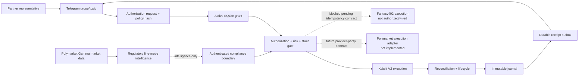

# Partner Execution Expansion Map

This is the single orientation map for partner communication, permissioned
execution, provider lifecycle, and cross-venue expansion. It describes current
runtime authority, not a promise that every pictured provider can place orders.

## Generate the map

```bash
bun run ops:map
bun run ops:map -- --output=artifacts/partner-expansion.mmd
bun run ops:status -- --json
```

`ops:map` emits Mermaid from the code-owned map in
[`src/partner/domain.ts`](../src/partner/domain.ts). Dashed edges are future or
intelligence-only contracts. They must not be interpreted as live execution.



## Current capability boundary

| Surface | Current role | Execution state |
| --- | --- | --- |
| Telegram | Hash-bound approval/revocation provenance and durable receipts | Cannot place or arm a bet by itself |
| Partner registry | Resolves partner, out, skin, provider, currency, and limits | Required identity/configuration boundary |
| Kalshi | Authorized order/cancel, deterministic reconciliation, lifecycle, journal | Built, default off; production graduation still gated |
| Polymarket | Public Gamma market ingestion, ticks, line moves, compliance intelligence | Read-only; no partner authorization or order adapter |
| Fantasy402 | Inventory, odds/HAR mapping, and legacy ticket ingest | Not connected to authorized execution |

## Identifier and mapping contract

Do not collapse identifiers from different authorities:

| Authority | Stable identifiers | Binding rule |
| --- | --- | --- |
| Partner | `partnerCode`, `outId`, `skin`, `provider`, `currency` | Exact tuple is bound by the authorization policy hash |
| Telegram | numeric chat, topic, message, and approving-user IDs stored as strings | Approval must match the allowlisted channel/topic/user and request hash |
| Local execution | reservation ID, execution idempotency key, authorization ID | One immutable request and exposure lane |
| Kalshi | ticker, order ID, deterministic `client_order_id`, fill/trade ID, subaccount | Primary-account evidence and exact order terms only |
| Polymarket | event ID, market ID, `condition_id`, slug | Intelligence identity only; never substitute for a Kalshi ticker |

A future cross-venue adapter needs an explicit versioned mapping such as
`canonical_event_id ↔ Kalshi ticker ↔ Polymarket condition_id/market_id`, plus
provider-side idempotency, account authorization, balance/liquidity snapshots,
cancel semantics, partial-fill lifecycle, settlement evidence, and journal
mapping. None of those requirements may be inferred from a shared event name.

## Expansion acceptance gates

Polymarket execution remains unwired until it has parity with the Kalshi safety
boundary:

1. provider-owned credentials and account identity;
2. deterministic provider-side idempotency and exact lookup reconciliation;
3. executable price/liquidity and signed balance snapshots;
4. order, partial-fill, cancellation, position, and settlement normalization;
5. authorization policy binding and transactional exposure reservation;
6. immutable integer-minor-unit journal entries and drift checks;
7. durable partner receipts, demo evidence, and a separately reviewed arm gate.

Public Polymarket data may inform regulatory monitoring today, but it cannot
grant permission, select an account, or prove a provider execution outcome.

## Canonical concept graph

The glossary models this flow with stable IDs and reciprocal `seeAlso` edges:

`partner.authorization.request` → `partner.authorization.grant` →
`partner.execution.gate` → `partner.execution.reservation` →
`partner.execution.provider_lifecycle` → `partner.execution.journal` →
`partner.execution.receipt`.

The separate `provider.polymarket.intelligence_only` concept makes the
read-only boundary machine-discoverable. Inspect these entries through the HQ
glossary, `GET /api/glossary`, or `bun run glossary:dump`; validate the graph
with `bun run glossary:check` and `bun run partners:validate`.

Visual evidence produced from partner/liquidity dashboards carries
`snapshot.visual.provenance`: native `Bun.WebView` backend/viewport and runtime
identity plus `Bun.Image.metadata()` for the screenshot and thumbnail. This is
review evidence only; execution freshness continues to come from the typed
market/account `ExecutionSnapshot` immediately before reservation.
The metadata also binds SHA-256 and byte length for generated artifacts;
partner WebView/CDP summaries use the same runtime/integrity vocabulary and
strip query/hash credentials from persisted URLs.

## External references

- [Telegram Bot API](https://core.telegram.org/bots/api)
- [Telegram bots introduction and token safety](https://core.telegram.org/bots)
- [Kalshi API documentation](https://docs.kalshi.com/)
- [Kalshi OpenAPI contract](https://docs.kalshi.com/openapi.yaml)
- [Polymarket API introduction](https://docs.polymarket.com/api-reference/introduction)
- [Polymarket quickstart](https://docs.polymarket.com/quickstart)

## See also

- [GitHub Wiki documentation hub](https://github.com/brendadeeznuts1111/Kalshi-bot/wiki)
- [Seat-ops architecture](SEAT-OPS.md)
- [Canonical glossary and partner concept graph](GLOSSARY.md)
- [Authorized partner execution](AUTHORIZED_EXECUTION.md)
- [Authorized execution delivery record](AUTHORIZED_EXECUTION_REMAINING_WORK.md)
- [Demo proof schema](EXECUTION_DEMO_PROOF_SCHEMA.md)
- [Regulatory agents and Polymarket intelligence](regulatory-agents.md)
- [Partner/Fantasy Ultra boundary](PARTNER-FANTASY-ULTRA.md)
- [Official URL catalog](OFFICIAL_URLS.md)
- [Environment naming and arm flags](ENV_NAMING.md)
