# Kalshi GitHub Bot Research Agent — Plan (as-built)

## Goal

Build a **re-runnable** research script that produces a scored shortlist of public Kalshi bots on GitHub. Popularity is a **gate only**; ranking is **engineering quality + strategy diversity**, with TypeScript/Bun as the stack tiebreaker.

**Status:** Implemented. Run with `bun run research`; browse with `bun run serve`.

## Bun-native layer (first-class)

**Zero runtime dependencies.** Toolchain is Bun + authenticated `gh` CLI. Before adding any npm package, check [`docs/BUN_NATIVE.md`](BUN_NATIVE.md).

| Capability | Runtime utility |
|------------|-----------------|
| `gh` subprocess | `Bun.$` + `.json()` / `.nothrow().quiet()` |
| Preflight | `Bun.which("gh")` |
| Config | `Bun.file(…).json()` |
| Artifacts | `Bun.write` |
| Env overrides | `Bun.env` (`RESEARCH_MIN_STARS`, etc.) |
| Paths | `import.meta.dir` + [`paths.ts`](../src/research/paths.ts) |
| CLI entry | `#!/usr/bin/env bun` + `import.meta.main` |
| Cache + runs | `bun:sqlite` keyed by `Bun.hash(repo+endpoint+pushed_at)` |
| GitHub URL SSOT | `BunURLPattern` in [`patterns.ts`](../src/research/patterns.ts) |
| Report browser | `Bun.serve` [`serve.ts`](../src/research/serve.ts) — ≤5 routes |
| Audit evidence | sha3-256 JSONL under `research/audit-evidence/` (committed) |
| Scheduled research | OS-level `Bun.cron` — [`docs/CRON.md`](CRON.md) |
| Tests | `bun:test` + `mock.module()` for `gh.ts` |

## Stack and layout

```
Kalshi-bot/
  package.json              # no dependencies block
  bunfig.toml               # [run] shell=bun, [test] coverage
  tsconfig.json
  src/
    research/               # discover → gate → inspect → score → diversify → report
      … (see README layout)
    agent/                  # dashboard, CLI, audit-list, suggest-lift, verify-dashboard
  tools/
    restore-latest-report.ts  # posttest: fixture → latest.md
  tests/                    # bun:test (126 tests; posttest report restore)
  docs/
    CRON.md                 # OS-level Bun.cron setup
  research/
    queries.json, weights.json, keywords.json
    schemas/repo-report.schema.json
    audit-evidence/         # committed JSONL (one file per promoted repo)
    cache/cache.db          # gitignored sqlite
    outputs/                # gitignored JSON dumps
    exports/audit/          # gitignored per-run rotor bundles
    reports/                # latest.md + latest.diff.md (committed)
```

## Pipeline

```mermaid
flowchart LR
  preflight[Bun.which gh] --> discover[discover via gh]
  discover --> gate[popularity gate]
  gate --> inspect[inspect + sqlite cache]
  inspect --> score[quality + license]
  score --> diversify[diversity shortlist]
  diversify --> diff[diff vs prior production run]
  diff --> out[sqlite run + MD report]
  out --> audit[optional --export-audit]
```



## Discover

Query set in [`research/queries.json`](../research/queries.json). Dedupe by `full_name`. Cap ~100 candidates (`candidateCap`).

## Popularity gate

- `stargazers_count >= 5` **or** `forks_count >= 3`
- `pushed_at` within **18 months**
- Not archived

Overrides: CLI flags or `RESEARCH_*` env vars.

## Inspect (no clone)

Concurrency **4**. API responses cached in `cache.db` keyed by `repo+pushed_at`.

| Signal | Method |
|--------|--------|
| License | repo metadata — `spdxId` or `key` from gh; unlicensed penalized; MIT/Apache preferred |
| Auth / API (25 pts) | scoped `gh search code` — `KALSHI-ACCESS-*`, `trade-api/v2`, SDK markers |
| Order realism (25 pts) | scoped code search — orders paths, dry-run defaults |
| Tests + CI | tree / contents |
| Docs / setup | README sections |
| Maintenance | default-branch commit dates |
| Strategy tags | README + code keyword lists |
| Risk controls | keyword hits |

`sdk_only` repos appear in report but are **excluded from shortlist**.

## Score + shortlist

Six components (100 pts) in [`research/weights.json`](../research/weights.json). License modifier −15 for unlicensed.

Shortlist ([`diversify.ts`](../src/research/diversify.ts)): size 12 (configurable), min 1 per major strategy tag, max 4 per tag, TS/JS tiebreak within threshold.

Factor stack SSOT: [`docs/FACTOR_STACK.md`](FACTOR_STACK.md).

## Cache + runs (`bun:sqlite`)

Embedded `research/cache/cache.db` (gitignored):

- **api_cache** — `Bun.hash(repo:endpoint:pushed_at)`, TTL on `expires_at`
- **runs** — full `ResearchRun` JSON by `run_id` (enables diff without committed JSON)

Inspect concurrency: `pool.ts` + `DEFAULT_INSPECT_CONCURRENCY` (default 4).

Queryable: `searchCachedPayloads("readme", "websocket")`.

**Artifacts:** JSON → `research/outputs/` (gitignored). Markdown → `latest.md` + `latest.diff.md` (committed).

## Diff

- Default baseline: latest **production** run in sqlite (`isProductionRunId` + `isEligibleProductionRun`; skips test fixtures and far-future ids)
- Fallback: `outputs/latest.json`
- **`--diff <run-id>`** — explicit baseline

Outputs: [`research/reports/latest.diff.md`](../research/reports/latest.diff.md).

## CLI

```bash
bun run research                      # full pipeline
bun run dashboard                     # agent dashboard (:3457)
bun run agent status                  # CLI status + rotor verification
bun run agent audit-list              # shortlist vs audit-catalog.json
bun run agent suggest-lift            # component lift map (rotor badges)
bun run research -- --json            # stdout JSON
bun run research -- --shortlist 12
bun run research -- --diff <run-id>
bun run research -- --export-audit    # + audit JSONL + rotor bundle
bun run export-audit -- --latest      # re-export from cache
bun run export-audit -- --verify research/exports/audit/<run-id>
bun run serve                         # local browser (:3456)
bun test && bun run typecheck         # posttest restores latest.md from fixture
```

### Env overrides

| Variable | Purpose |
|----------|---------|
| `RESEARCH_MIN_STARS` | Gate min stars |
| `RESEARCH_MIN_FORKS` | Gate min forks |
| `RESEARCH_MAX_AGE_MONTHS` | Max repo age |
| `RESEARCH_SHORTLIST` | Shortlist size |

## Output artifacts

| Path | Tracked? | Contents |
|------|----------|----------|
| `research/outputs/run_*.json` | gitignored | Full run dump |
| `research/cache/cache.db` | gitignored | API cache + runs |
| `research/reports/latest.md` | **committed** | Human shortlist + license callouts + evidence |
| `research/reports/latest.diff.md` | **committed** | Diff vs previous production run |
| `research/reports/run_*.md` | gitignored | Per-run MD (history in cache.db) |
| `research/audit-evidence/*.jsonl` | **committed** | Line evidence for promoted repos |
| `research/exports/audit/<run>/` | gitignored | Finding wire + rotor-ingest.json |

## Local report browser

| Route | What |
|-------|------|
| `/` | Stats, shortlist, scored table, diff, run history |
| `/api/runs` | Run summaries JSON |
| `/api/runs/:id` | Full run JSON |
| `/repo/:owner/:name` | Repo detail (`?run=<id>`) |
| `/reports/latest.md` | Committed markdown |

## Audit adapter (optional)

High-value (≥70) and **watchlist** (≥65) shortlist repos export to monorepo-compatible `AuditFinding` wire. Agent CLI cross-references rotor catalog + pulse. See [`docs/AUDIT_ADAPTER.md`](AUDIT_ADAPTER.md) and [`docs/AGENT.md`](AGENT.md).

## Testing

- **126 tests** across research + agent (`bun test`; `posttest` restores `latest.md` from fixture)
- Pure: gate, score, detect, patterns, evidence, validate, cache, audit adapter, agent audit-list
- `mock.module("../src/research/gh.ts")` — inspect tests never hit network
- Live integration: `bun run research` only

## Scheduling

OS-level weekly research via `Bun.cron` — see [`docs/CRON.md`](CRON.md). Separate from `serve` and manual `bun run research`.

## Out of scope

Cloning third-party repos, live trading, merging into `kal-poly-bot`.
